

# FindPotty Features

## Login

    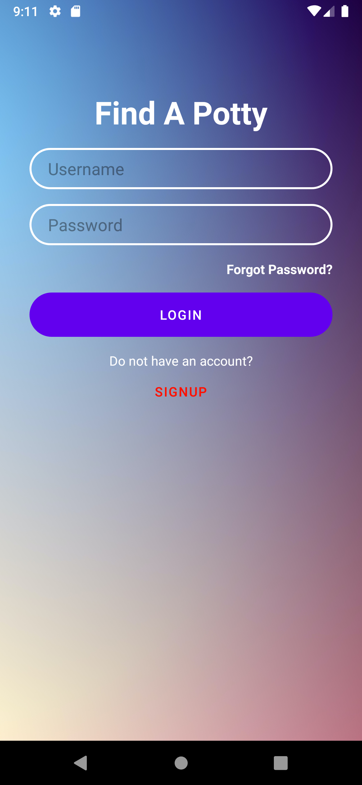

    

## Markers and info page

    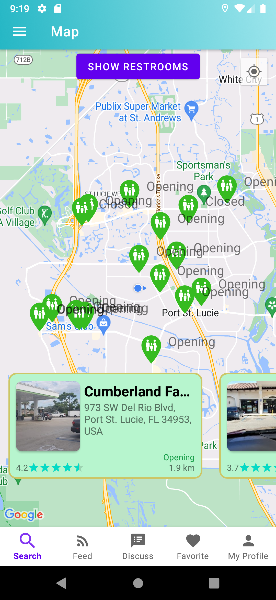
    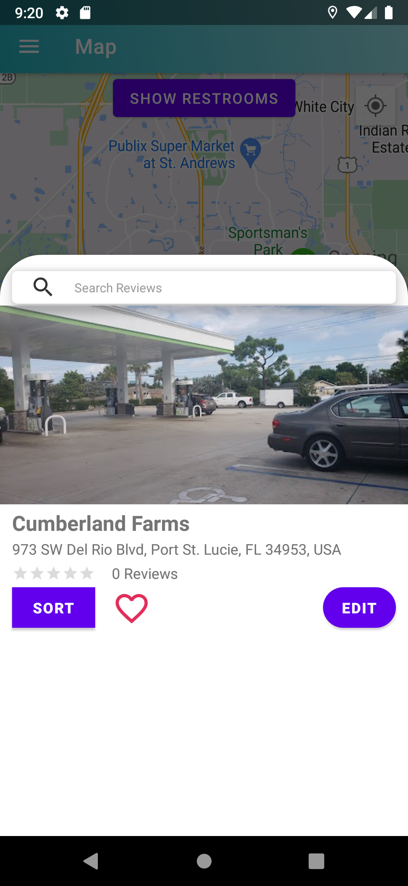

    

        This application's main functionality and display is the map. The map's function is to navigate users to the nearest restroom within a timely manner by displaying markers for all available restrooms. Each marker contains information about the restroom in the location such as address and name of the restroom.
    

## Potty Diary

    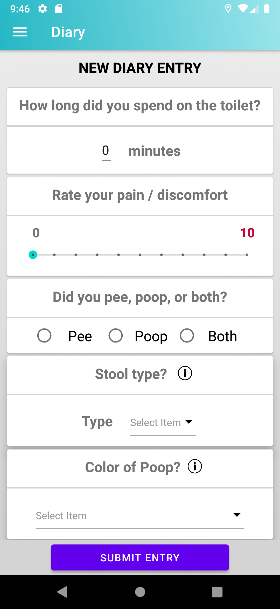
    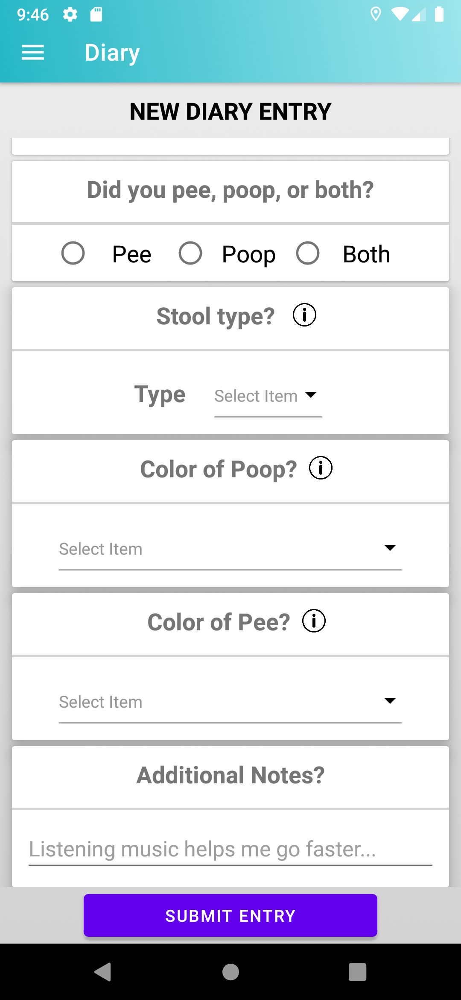

    

        This feature keeps a record of user journal bowel movement information. The user will be prompted to answer questions about their most recent bowel and bladder moment. The question will focus on collecting information on the user’s comfort and habits during the experience and much more.
    

## Potty Trends

    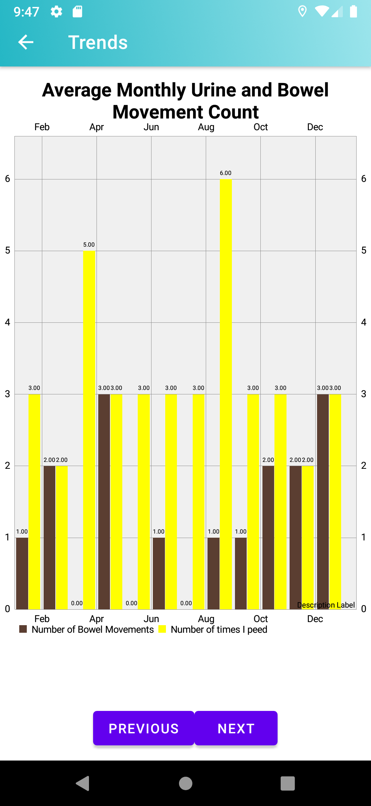
    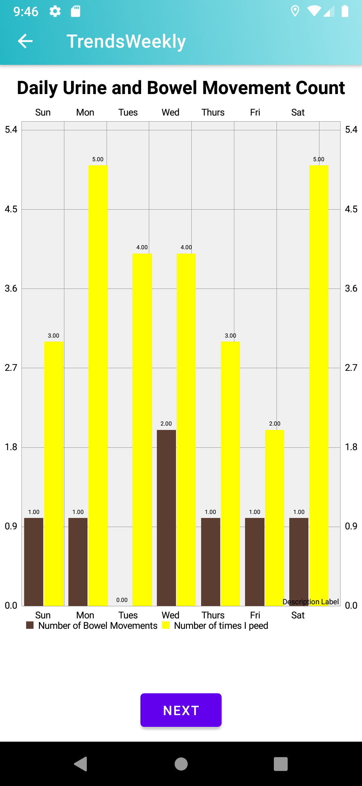
    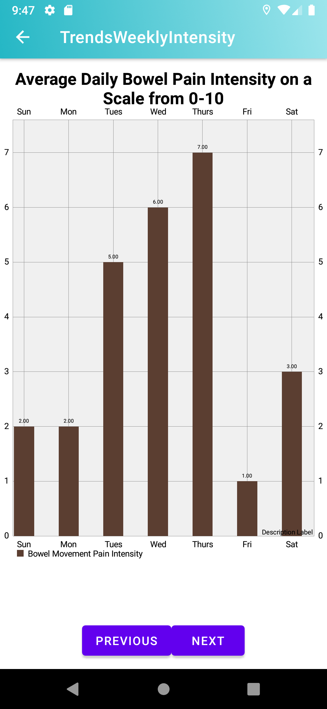
    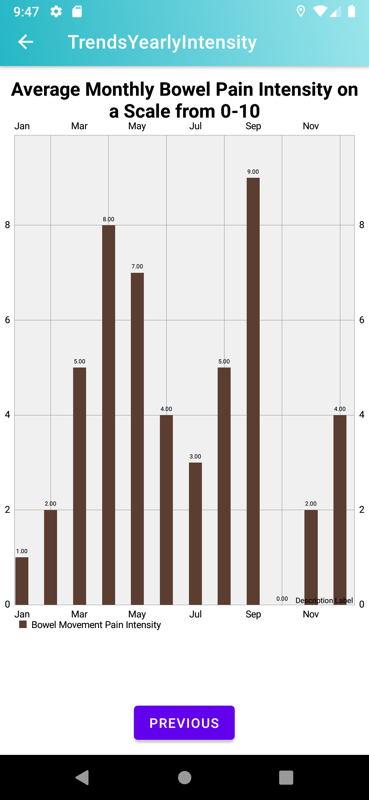

    

        Contains a trends feature that will display various user history and bio related metrics. This feature is in correlation to the potty journal submissions where the submission answers are tracked and displays a visual representation of the trends.
    

## Newsfeed

    

    

        Displays a list of news articles for users to read through. Its functionality is for users to have something to do while using the restroom and make using the restroom a more entertaining experience. 
    

## Trainer

    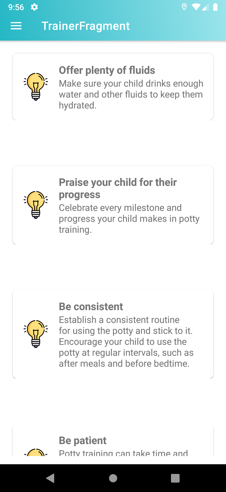

    

        A guide for users in potty training or any potty related needs. In this case, a list of tips are displayed and users are able to be aware of information they may or may not know about.
    

## Toilet Tunes

    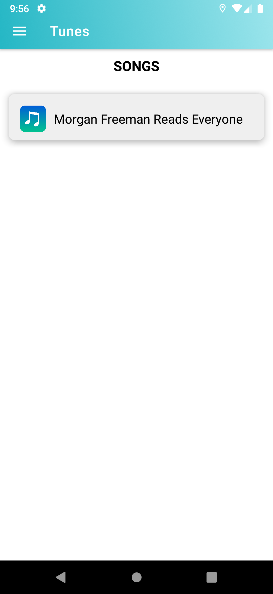
    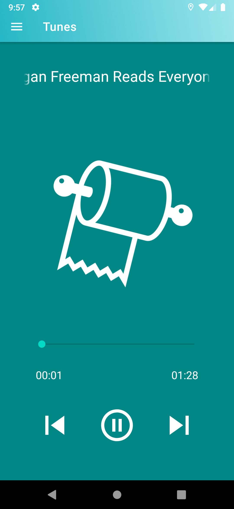

    

        Tunes can be played while the user is in the restroom to cancel out external distracting noises and help induce relaxation.
    

## User Profile

    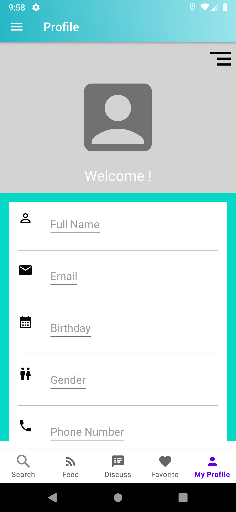

    

        For each account created, each user has their own profile which displays a unique username and profile image. The profile page includes the user’s personal information: name, email, birthday, and gender.
    

## Review

    

        Users are able to write a review for the restrooms listed. They are able to express their opinion about the restroom and indicate a star rating.
    

## Reminder

    

        Users can schedule a reminder for any sort by indicating the time, date, and description of what the reminder is for.
    

## Edit Restroom Page

    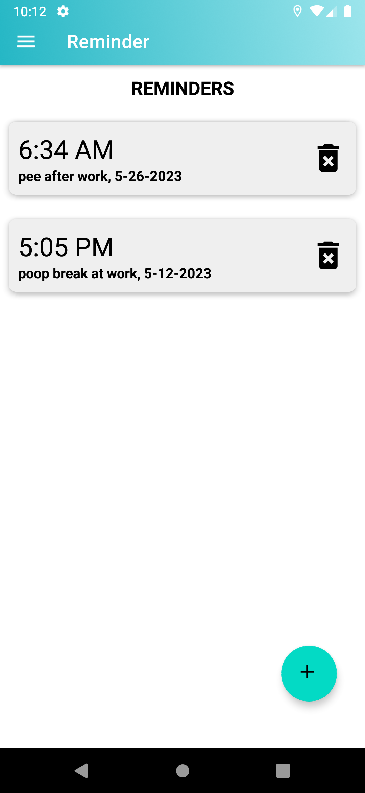

    

        Restroom pages are able to be modified after one has been created. The name and description of the restroom page are edited and updated once submitted.
    

## Discussion

    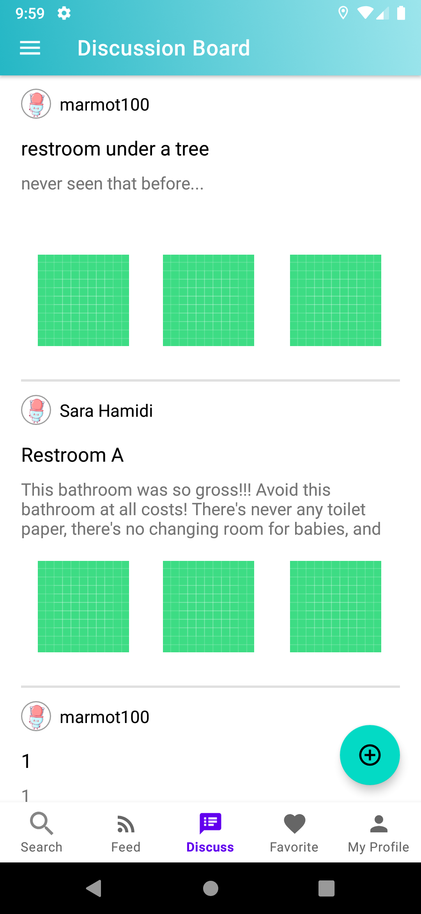
    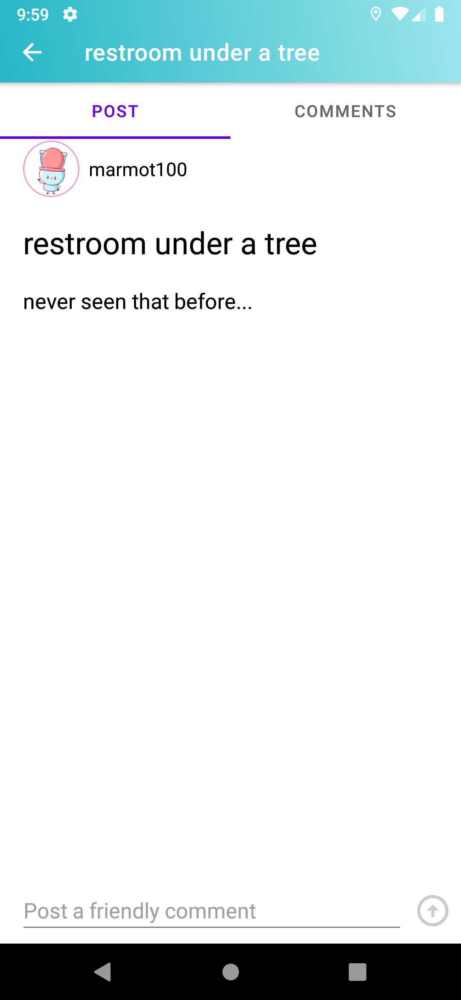

    

        Users are able to interact with one another by creating posts. Under each posts, users can also make comments.
    

# Reference

- [FindPotty](https://github.com/kaylynnkk/FindAPotty)